# is-agentcore-the-new-lambda ?

An investigation of how AgentCore works and whether it could become the new Lambda.

## Context

The last [AWS Community Day Spain 2025 Zaragoza](https://awscommunity.es/) was on Saturday, November 15, 2025. The keynote was given by [Álvaro Hernández Tortosa](https://www.linkedin.com/in/ahachete/). The title of the talk was *"Now Go Unbuild"*, and it introduced a set of five challenges or out-of-the-box ideas about AWS services. One of these services was AgentCore, and the challenge was: "Is AgentCore the new Lambda?"

## Hands On

I basically accepted this challenge, and in this repository I want to test the possibility of running AgentCore as the new version of Lambda. Why? Because it seems the best way to learn — what works, what doesn't, and why.

## What is AgentCore?

Amazon Bedrock AgentCore is an AWS service that provides the foundation for building, deploying, and operating AI agents at scale (similar to AWS Lambda but with AI). It offers the necessary infrastructure for handling agent workloads, including:

- Serverless runtime
- Memory management for short and long-term context
- Tool integration via AgentCore Gateway
- Secure authentication

## Experiments

### Step 0: Run AWS Bedrock AgentCore with AI Model

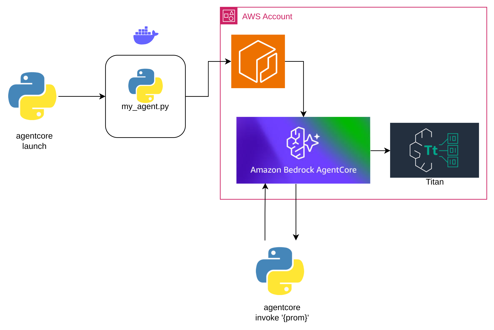


**Folder:** `0_Run_default_Agentcore`

This folder contains a basic implementation of AgentCore with Titan model. I deploy a simple AgentCore and test the deployment process.

**Features:**
- Basic AgentCore setup
- Integration with Amazon Titan model
- Deployment testing

The deploy was ok and I can run the Agentcore with Amazon Titan Model ✅

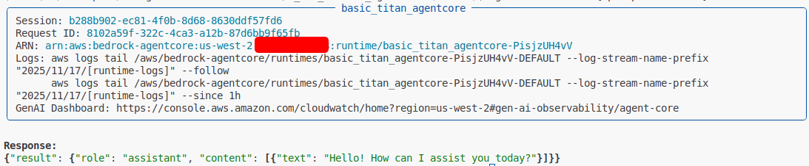

### Step 1: Run AgentCore without AI Model

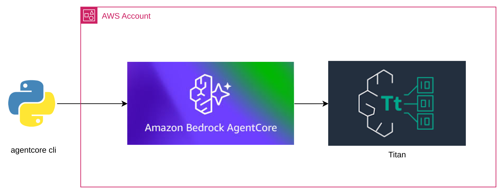

**Folder:** `1_Run_AgentCore_without_AI_model`

This experiment tests AgentCore as a pure compute service without AI models, making it more similar to Lambda.

**Features:**
- AgentCore without AI dependencies
- Simple mathematical operations (addition)
- Payload processing: `{"prompt": {"a":1,"b":2}}` → `{"result": 3}`

The first test passed! I can remove the AI model and run AgentCore as compute processing... ✅

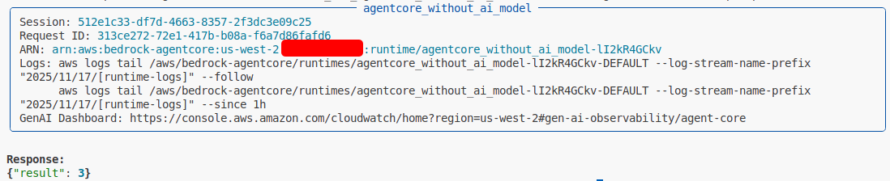

### Step 2: Send a Message to SQS

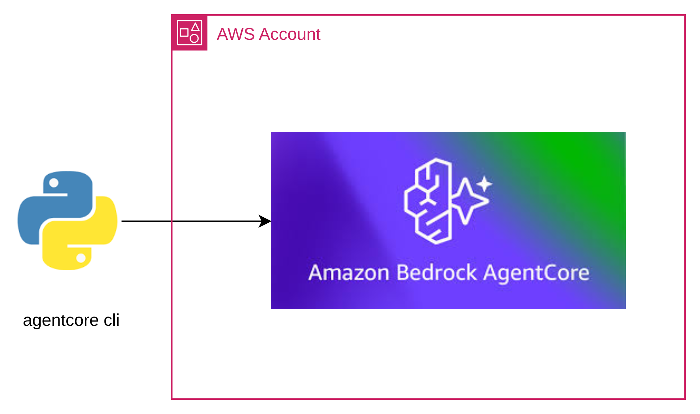

Now things got interesting. I wanted to test if AgentCore could handle one of the most common Lambda patterns: processing data and sending results to SQS for asynchronous processing.

The implementation was straightforward - I extended the mathematical operations from Step 1 to also send the results to an SQS queue. But here's where I learned something important about AgentCore vs Lambda:

**The Challenge:** Environment variables and IAM permissions work differently than Lambda. While Lambda automatically inherits the execution role permissions, AgentCore required explicit IAM policy creation and attachment.

**The Result:** AgentCore can absolutely replicate Lambda + SQS patterns. The payload `{"prompt": {"a":5,"b":3}}` returns `{"result": 8, "message_sent": true, "message_id": "..."}` and the structured message appears in the SQS queue.

The second test passed! I can send a message to SQS! ✅

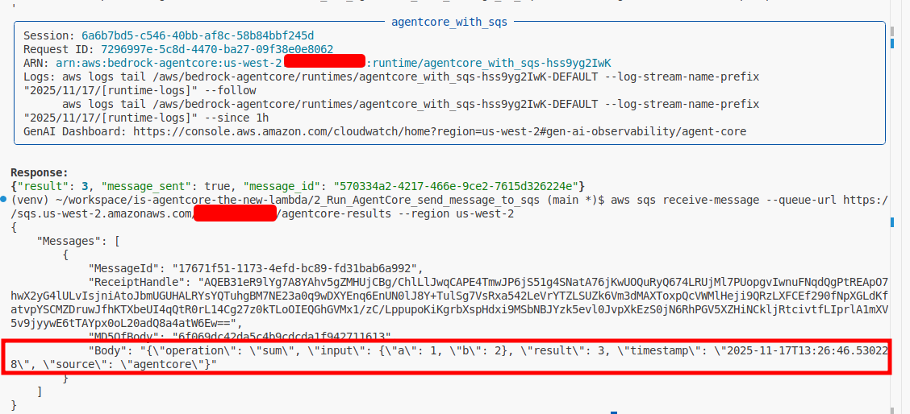

### Step 3: Save JSON to S3 from AgentCore

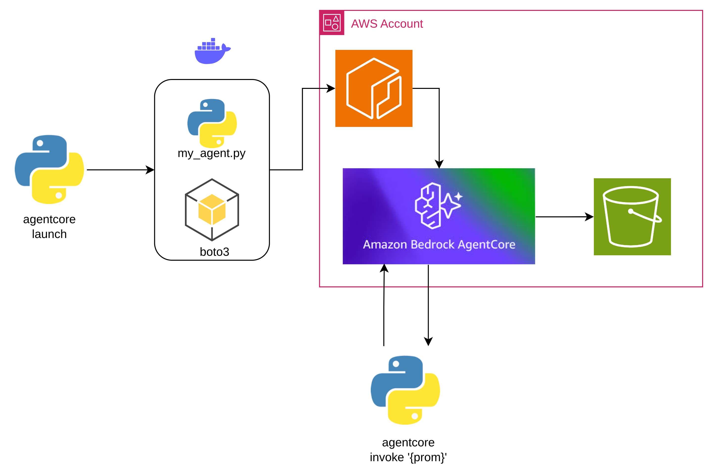


After proving AgentCore could handle SQS integration, I wanted to test another common Lambda pattern: storing structured data in S3 for analytics and long-term persistence.

**The Implementation:** I built on the mathematical operations but this time stored the results directly in S3 with a well-structured JSON format and date-based partitioning.

**The Challenge:** Similar to Step 2, I needed to configure S3 permissions explicitly. AgentCore required its own IAM policy for S3 `PutObject` operations.

**The Process:**
1. ✅ Created S3 bucket: `agentcore-results-is-agentcore-new-lambda`
2. ✅ Implemented S3 client integration with date partitioning
3. ✅ Added environment variable `S3_BUCKET_NAME` to Dockerfile
4. ✅ Created and attached IAM policy for S3 permissions
5. 🎉 **Success!** AgentCore now stores structured JSON data in S3

**The Result:** AgentCore successfully stores calculation results in S3. The payload `{"prompt": {"a":1,"b":2}}` returns `{"result": 3, "s3_stored": true, "s3_key": "agentcore-results/2025/11/18/uuid.json", "request_id": "uuid"}` and creates a properly formatted JSON file in S3 with date partitioning.

The third test passed! I can save JSON to S3 from AgentCore! ✅

The invoke to AgentCore:

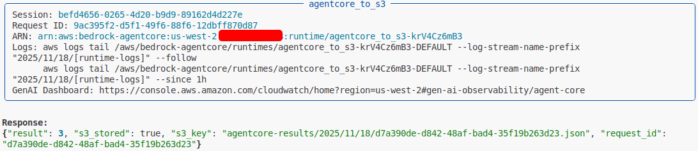

The file in the bucket:

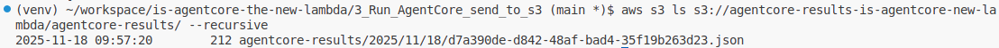

### Step 4: Store Data in DynamoDB from AgentCore

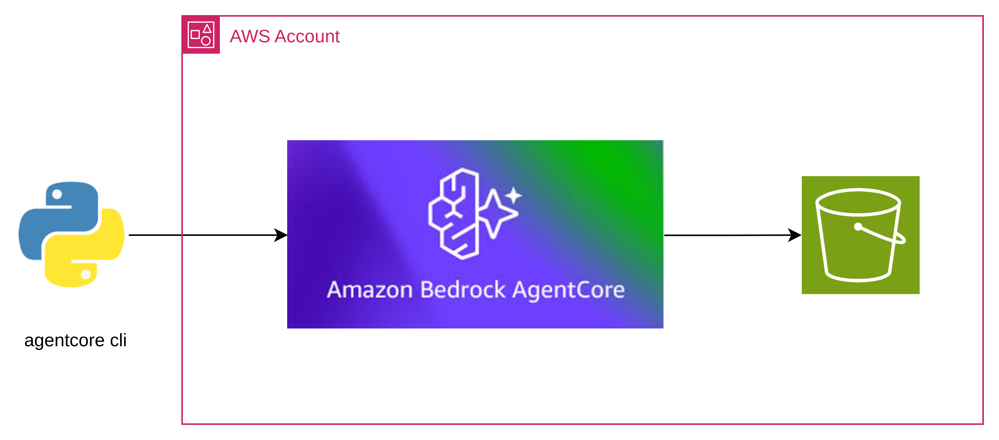

After successfully implementing file storage with S3, I wanted to complete the serverless stack by testing AgentCore with AWS DynamoDB.

**The Implementation:** I extended the mathematical operations to store calculation results in DynamoDB with automatic TTL (Time To Live) for data cleanup and structured attributes for efficient querying.

**The Challenge:** Similar to previous steps, DynamoDB required explicit IAM permissions. Additionally, I needed to configure the table schema and TTL settings for optimal performance.

**The Process:**
1. ✅ Created DynamoDB table: `agentcore-calculations` with TTL enabled
2. ✅ Implemented DynamoDB client integration with structured items
3. ✅ Added environment variable `DYNAMODB_TABLE_NAME` to Dockerfile
4. ✅ Created and attached IAM policy for DynamoDB permissions
5. ✅ Configured automatic data cleanup with 30-day TTL
6. 🎉 **Success!** AgentCore now stores structured data in DynamoDB

**The Result:** AgentCore successfully stores calculation results in DynamoDB. The payload `{"prompt": {"a":7,"b":2}}` returns `{"result": 9, "dynamodb_stored": true, "item_id": "uuid", "timestamp": "2025-11-18T12:48:00.000Z"}` and creates a structured item in DynamoDB with automatic cleanup.

The fourth test passed! I can store structured data in DynamoDB from AgentCore! ✅

The invoke AgentCore and response:

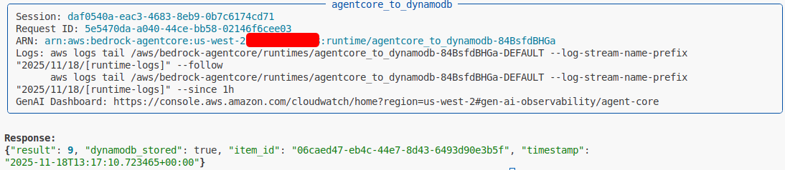

The DynamoDB with the operation sum stored

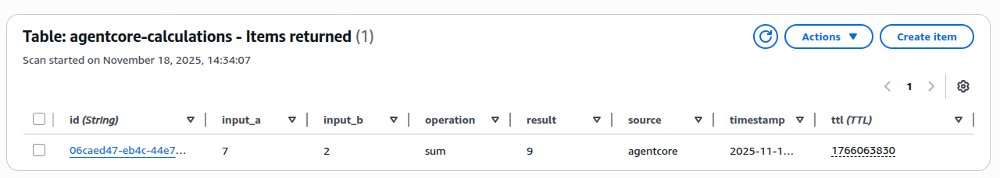

## 4.1 Long-Running Process Testing

### Timeout Behavior with Extended Delays

This implementation includes a configurable `DELAY_SECONDS` environment variable that allows testing AgentCore's behavior with long-running processes.

**Testing Long Delays:**
```bash
# Set delay to simulate long-running process (e.g., 20 minutes)
DELAY_SECONDS=1200  # 20 minutes
```

**Expected Behavior:**
- **Short delays (< 60 seconds):** `agentcore invoke` works normally
- **Long delays (> 15 minutes):** `agentcore invoke` will likely timeout
- **AgentCore continues processing:** The agent keeps running in the background even after CLI timeout
- **DynamoDB write completes:** Data is still stored after the delay, regardless of CLI timeout

**Limitations of Synchronous Invocation:**
The `agentcore invoke` command appears to have a timeout limit (estimated ~30-60 seconds for CLI, potentially up to 15 minutes for the actual execution). For long-running processes exceeding this limit:

1. **CLI times out** but **agent continues processing**
2. **Data is still written** to DynamoDB after the delay
3. **No response received** via CLI due to timeout

**Asynchronous Invocation Alternative:**
For production use cases with long-running processes, you would need to:
- Use the **AWS SDK** to invoke AgentCore asynchronously
- Implement **callback mechanisms** or **status polling**
- Use **SQS/SNS** for result notifications
- Monitor via **CloudWatch logs** instead of CLI response

**Example SDK Invocation (Python):**
```python
import boto3

client = boto3.client('bedrock-agentcore')
response = client.invoke_agent_runtime(
    agentRuntimeArn='arn:aws:bedrock-agentcore:region:account:runtime/agent-id',
    payload=json.dumps({"prompt": {"a": 1, "b": 2}}).encode(),
    contentType='application/json'
)
```

The proof 4.1 passed but with comments:

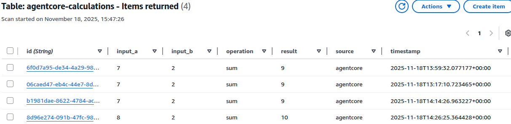
### Step 5: API Gateway + AgentCore Integration

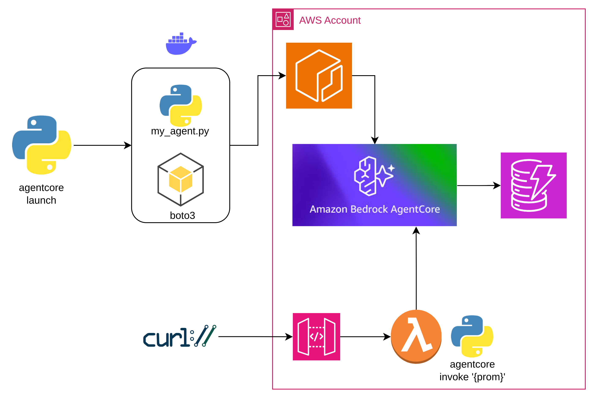

**Folder:** `5_API_Gateway_AgentCore_Integration`

The final and most ambitious test: creating a complete HTTP API that exposes AgentCore through API Gateway, making it accessible like any REST API.

**Features:**
- Complete API Gateway setup with Lambda proxy
- Real AgentCore integration using `bedrock-agentcore:InvokeAgentRuntime`
- Dynamic AWS account ID detection
- Streaming response processing
- Comprehensive error handling and validation
- CORS support for web applications

**The Challenge:** This was the most complex integration, requiring:
1. Correct boto3 version (>= 1.40.75) for AgentCore support
2. Proper IAM permissions for `bedrock-agentcore:InvokeAgentRuntime`
3. Correct ARN format: `arn:aws:bedrock-agentcore:region:account:runtime/{agent_id}`
4. Handling AgentCore's streaming response format

**The Process:**
1. ✅ Created SAM template with API Gateway and Lambda
2. ✅ Implemented Lambda proxy with AgentCore SDK integration
3. ✅ Configured IAM permissions for AgentCore runtime access
4. ✅ Added streaming response processing
5. ✅ Implemented dynamic ARN construction
6. 🎉 **Success!** AgentCore now accessible via HTTP API

**The Result:** AgentCore successfully exposed through API Gateway. HTTP POST requests to the API endpoint invoke the real AgentCore agent and return structured responses, completing the serverless integration stack.

**Example API Call:**
```bash
curl --location 'https://y7ei22swo7.execute-api.us-west-2.amazonaws.com/prod/calculate' \
--header 'Content-Type: application/json' \
--data '{"prompt": {"a": 5, "b": 5}}'
```

The fifth test passed! AgentCore works as "the new Lambda" with HTTP API access! ✅

The HTTP request:

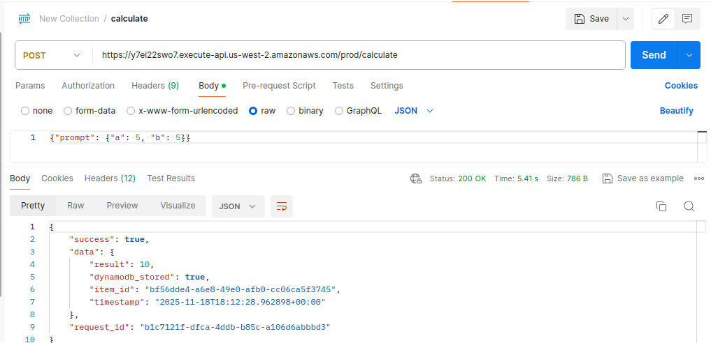

The ID in DynamoDB stored:

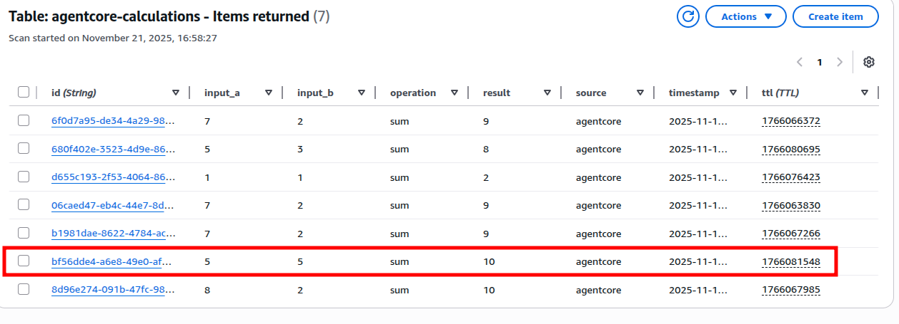

## Getting Started

1. Install AgentCore CLI:
   ```bash
   pip install "bedrock-agentcore-starter-toolkit>=0.1.21" strands-agents strands-agents-tools boto3
   ```
2. Navigate to the desired experiment folder
3. Run `./setup.sh` to install dependencies
4. Configure AgentCore: `agentcore configure -e my_agent.py`
5. Deploy using `agentcore deploy`
6. Test with `agentcore invoke`


## Requirements

- Python 3.10+
- AWS CLI configured
- Bedrock AgentCore CLI
- Docker (for deployment)

## References

- [AWS Bedrock AgentCore Developer Guide](https://docs.aws.amazon.com/bedrock-agentcore/latest/devguide/agentcore-get-started-toolkit.html)
- [Amazon Bedrock AgentCore](https://aws.amazon.com/es/bedrock/agentcore/)
- [How to Deploy an AI Agent with Amazon Bedrock AgentCore](https://www.freecodecamp.org/news/deploy-an-ai-agent-with-amazon-bedrock/) 
- [Boto3 documentation V1.40.75](https://boto3.amazonaws.com/v1/documentation/api/latest/index.html#)
- [Runtime Invoke Agent - Bedrock Agentcore](https://docs.aws.amazon.com/bedrock-agentcore/latest/devguide/runtime-invoke-agent.html)
- [Agentcore GetStarted](https://docs.aws.amazon.com/bedrock-agentcore/latest/devguide/agentcore-get-started-toolkit.html)